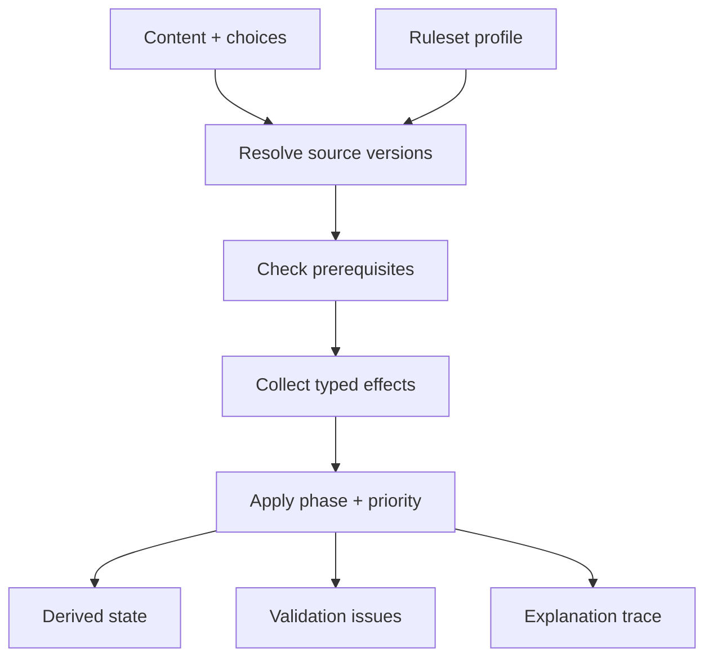

# Adventurer Ledger — initial architecture

## Solution

A local-first PWA with three independent cores:

1. **Content registry** — immutable/versioned definitions with provenance, visibility and export policy.
2. **Character state** — user choices, mutable play state, snapshots and overrides referencing stable content IDs.
3. **Rules evaluation** — pure deterministic functions return derived values, validation issues and an explanation trace.

“Valid” is not a single global boolean. A ruleset profile determines whether a failed requirement is hard, soft or informational. Overrides record the rule, source, character, date and reason.

## Separation

| Layer | Git | Normal export | Runtime |
| --- | --- | --- | --- |
| App, schemas, engine, tests | yes | yes | bundle |
| Correctly licensed public seed | yes | yes | IndexedDB |
| Original test content | yes | yes | IndexedDB |
| User-entered owned-source text | no | no | IndexedDB or ignored files |
| References/backups/imports | no | explicit only | local files |

Private repo visibility is additional access control, **not** the privacy architecture.

## Stack

Next.js, React, strict TypeScript, Zod, Zustand, Dexie/IndexedDB, Vitest and later Playwright. Tailwind/shadcn-compatible primitives can be added incrementally. PostgreSQL/Prisma and sync are deferred to avoid a second source of truth and larger privacy surface.

## Data model

Executable definitions: `src/domain/model.ts`.

- Provenance/content: `Source`, `ContentPack`, `ContentEntry`; specialized class, feature, subclass, species, background, feat, spell, item, weapon, armor and tool types.
- Declarative support: `ChoiceDefinition`, `Effect`, `PrerequisiteDefinition`, `ResourceDefinition`, `ProficiencyDefinition`.
- Configuration: `RulesetProfile`, `Campaign`.
- Characters: `Character`, `CharacterSelection`, `CharacterVersion`, `CharacterSnapshot`, resource/inventory/spell/attack/condition state.
- Validation/operations: `ValidationIssue`, `OverrideDecision`, `ImportJob`, `ExportJob`, `MigrationRecord`.

New features normally add validated data rather than database migrations.

## Rules engine



Effects are a discriminated union. Conditions use explicit `all/any/not` and named predicates. Values are literals, safe paths or allow-listed named formulas—never executable JavaScript and never `eval`.

Evaluation phases: grants/replacements; base/set calculations; min/max; modifiers; advantage/tags; actions/resources; validation. Source/effect priorities guarantee deterministic order. Every effect reports applied/skipped/error with a reason; silent overwrite is forbidden.

## Private content packs

```json
{
  "schemaVersion": 1,
  "pack": {
    "id": "my-private-library",
    "name": "My Private D&D Library",
    "version": "1.0.0",
    "rulesEditions": ["2024", "2014"],
    "visibility": "private",
    "licenseType": "private-owned-source",
    "exportRestricted": true,
    "includeFullText": true
  },
  "sources": [],
  "entries": []
}
```

One `entries` array gives every category the same validation, migration, duplicate and conflict path. Import pipeline: byte limit → JSON parse → forbidden-key/depth scan → schema migration → strict Zod validation → duplicate/conflict dry run → explicit IndexedDB transaction → sanitized job record.

## Local storage

Dexie/IndexedDB is authoritative. Declarative effects/choices remain JSON in versioned entries; mutable runtime state is separate. Snapshot before level-up/import/restore. Migrations are transactional. Private text never enters logs. Later: persistence health, backup freshness, missing-reference recovery and OPFS/Tauri file references.

## Encryption/backups

Full vault backups use canonical JSON encrypted with AES-256-GCM and a random 96-bit nonce. Initial key derivation: PBKDF2-HMAC-SHA-256 with salt and calibrated iterations; the envelope records KDF/version for later Argon2id. Password/derived key never persists.

Modes: safe character export without private definitions; confirmed portable export with explicit private dependencies; full encrypted vault; local automatic snapshots. IndexedDB itself is not considered encrypted at rest and lost passwords cannot be recovered.

## MVP roadmap

1. **Foundation (current):** separation, full initial types, Zod boundary, IndexedDB, typed evaluator, PWA shell, Brammel fixture and tests.
2. **Content registry:** CRUD editor, visual choice/effect editors, dry-run diff, source/ruleset CRUD and small attributed SRD seed.
3. **Single-class builder 1–20:** autosaved draft, origins, class/subclass, feats, skills, gear, spells, derived selector and overrides.
4. **Sheet/play/level-up:** tabs, resources/rest/undo, snapshots, before/after rollback, print CSS and safe exports.
5. **Hardening:** cache updates, persistent-storage health, accessibility, recovery and 25k-entry performance.

Phase 2: multiclassing, encrypted backups, Tauri/SQLite, advanced PDF, campaign/session management and optional encrypted self-hosted sync.

## First technical tasks

1. Canonical ID namespaces and collision tests.
2. Import dry-run add/update/conflict/skip with rollback.
3. Category-specific definition schemas under the stable envelope.
4. Formal evaluation phases and table-driven tests for every effect.
5. Schema-driven visual editors.
6. Source/ruleset CRUD with explicit diffs.
7. Character drafts/autosave and pure derived selector.
8. Brammel blank-to-printable golden path.
9. Attribution manifest and CI guard against tracked private entries.
10. Storage persistence, backup freshness and missing-reference recovery.

## Risks/decisions

| Risk | Mitigation |
| --- | --- |
| Private repo mistaken for separation | IndexedDB default, ignore rules, CI deny-list, restricted export |
| DSL becomes programming language | typed vocabulary, allow-list, no eval, trace |
| Over-generic UX | curated templates compile to effects |
| 2014/2024 overwrite | immutable versions + replacement edges + explicit choice |
| Browser eviction | persistence health + encrypted backup |
| Removed private pack | stable IDs + warnings + resolved snapshots |
| Flexibility hides broken math | separate save permission from calculation confidence |
| 25k entries hurt mobile | indexes, lazy full text, worker validation/search |
| Stale service worker/schema | explicit update UX and migrate-before-open |

Non-negotiable: manual/invalid values remain allowed but visibly distinct from automatically justified results.
