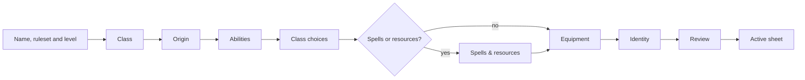
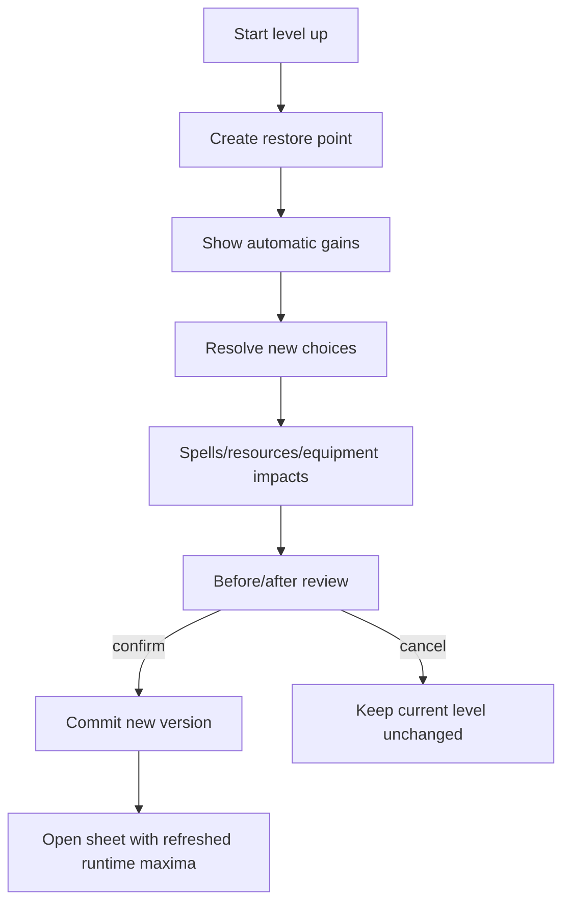

# Runefolio character creation, level-up, and edit flows

Settled M2.1 scope and semantics are recorded in [M2_DECISIONS.md](M2_DECISIONS.md); transactional ownership is defined in [M2_SERVICE_BOUNDARIES.md](M2_SERVICE_BOUNDARIES.md).

## Flow contract

Runefolio offers two presentations of one persisted draft:

- **Guided mode** recommends, explains, orders unresolved dependencies, and warns early.
- **Flexible mode** allows step skipping, invalid intermediate state, manual values, and overrides.

Mode is not stored as character truth. Switching presentation does not erase, reinterpret, or auto-fix choices.

Creation order:

1. Name, ruleset and level
2. Class
3. Origin
4. Abilities
5. Class choices
6. Spells & resources, when relevant
7. Equipment
8. Identity
9. Review



Arrows describe the recommended path, not a data-validity gate.

## Entry: new character

The first screen makes three decisions only:

- **Guided build** — recommended for learning or fast coherence;
- **Flexible build** — recommended for importing from paper or using table rules;
- optional **Use a future template/pregen**, deferred beyond the Brammel slice.

A blank draft is created only after the user chooses Start. The app then confirms “Draft saved on this device.” Back/cancel offers Keep draft or Delete empty draft; non-empty work defaults to Keep.

## Mobile step shell

```text
┌──────────────────────────────────┐
│ ‹ Characters       Draft saved  │
│ Step 2 of 9 · Class       2 ⚠   │
│ ██████░░░░░░░░░░░░░░             │
│                                  │
│ Choose a class                   │
│ What do you want to do in play? │
│ [ Search classes              ]  │
│                                  │
│ ★ Vanguard            Recommended│
│ Durable, direct weapon play   ›  │
│                                  │
│   Show all classes               │
├──────────────────────────────────┤
│ [Steps]               [Continue] │
└──────────────────────────────────┘
```

The footer is sticky but respects safe areas and does not obscure the focused control. “Steps” opens a bottom sheet with status per step: not started, in progress, complete, warning, or blocked calculation.

Autosave occurs after an accepted choice or committed field edit, not on every keystroke. An in-progress text field remains locally buffered; navigation prompts only when that buffer cannot be safely committed.

## Guided and flexible behavior

| Behavior | Guided | Flexible |
| --- | --- | --- |
| Recommended option | Ranked and explained | Optional filter, never preselected silently |
| Step order | Continue follows dependency-aware order | User may jump to any step |
| Missing required choice | Inline prompt and issue count | Saved as incomplete |
| Incompatible choice | Warning with compatible alternatives | Can keep with reason/override |
| Manual input | Available under “Enter manually” | First-class option |
| Derived value edit | “Override automatic value” disclosure | Direct but still records provenance |
| Review completion | Offers “Finish and open sheet” when guided-complete | Offers automatic or explicitly Manual sheet only when its corresponding renderable minimum is met |
| Mode switch | Always available from step menu | Always available from step menu |

Recommendations are deterministic and ruleset/source-aware. Each recommendation answers “Why this?” in one or two sentences and can link to a deeper explanation. Never claim that a recommendation is objectively best.

## Step specification

### 1. Name, ruleset and level

Purpose: settle who this is, which content interprets them, and how much of each
progression the build has to resolve — before any option list is loaded.

The step holds exactly three things:

- **Character name.** Autosaved as it is typed, and flushed on navigation, on a
  mode switch and on commit, so it survives a reload, a closed tab and a switch
  between guided and flexible. It is a warning, never a blocker: an unnamed
  character falls back to `Unnamed character`.
- **Ruleset.** Every installed profile is listed with the entry count and the
  level range its content covers. Selecting one persists it on the draft and
  scopes every later step to it. Nothing is ever selected by list order: with
  more than one usable profile and none activated, the app asks.
- **Intended starting level.** The maximum offered is derived from content — the
  longest run of consecutive class progression rows starting at level 1 — so the
  control never offers a level the installed pack cannot describe.

Selecting a level above 1 creates the character **at** that level. Every level's
progression is accumulated into one build: all reachable choices are exposed,
subclass and feat timing are honoured, unresolved choices block the commit, and
the commit writes that level directly. It is never a level 1 character that is
silently advanced afterwards.

If the chosen class covers fewer levels than the target, the step reports it and
names both repairs: lower the level, or choose a class whose content reaches it.

Changing the ruleset clears the class, subclass, origin, choices and equipment
selections, because those belong to the ruleset that defined them. The name,
level, ability scores and manual values are kept. Pronouns are no longer
collected anywhere in the flow; a value stored by an older build is preserved
untouched and feeds no calculation.

### 2. Class

Purpose: establish the character’s primary play loop and unlock dependent choices.

Option cards show name, source badge, short play-style summary, primary abilities, and complexity indicator. Guided mode can ask an optional intent question—front line, protect, explore, support, magic—used only for ranking.

Selecting a class opens a compact preview before commitment. For Brammel: select the original synthetic Vanguard definition. Multiclass controls are absent, not disabled teasers.

### 3. Origin

Purpose: choose 2024 origin components while keeping provenance explicit.

Origin is a step container, not a new rules object. It may contain species, background, languages, proficiencies, origin feat, and background-linked ability adjustments according to the active ruleset.

Use progressive disclosure:

```text
Origin
✓ Species: Riverborn
! Background: choose one
✓ Languages: Common + 1
  Review origin benefits ›
```

When a legacy or custom origin model differs, the UI labels the applicable rules and shows conflicts at the subchoice, not only on Review.

### 4. Abilities

Purpose: establish ability scores and show their derivation.

Methods:

- Standard array;
- Point buy, if enabled by ruleset;
- Rolled/manual;
- Import/current values in flexible mode.

The screen shows base assignment, origin contribution, other contributors, and final score separately. Dragging is never the only assignment mechanism; select controls and tap-to-assign remain available. Announce remaining points/options. Prevent accidental duplicate standard-array assignment, but allow a manual method that preserves unusual values.

Changing method requires a preview because it may clear assignments. Offer Cancel or Switch and keep a restore point.

### 5. Class choices

Purpose: resolve choices granted by the selected class and current level.

Render only applicable choice groups, in rules dependency order: proficiencies, fighting style, mastery, subclass when unlocked, and feature-specific choices. Each group shows `chosen / required` and why it exists. A resolved group collapses to a summary; it remains editable.

If a content definition is insufficient to render a safe selector, show a manual choice with the unresolved definition ID/path. Do not evaluate imported code or guess a choice.

### 6. Spells & resources, if relevant

Purpose: configure durable selections and preview runtime trackers.

This step is omitted from the recommended sequence only when no relevant definition exists; the step list explains “Not needed for this class at level 1.” Separate:

- known/prepared spell selection;
- resource maximum calculation;
- initial current value (normally full, but editable in flexible mode);
- spell/resource rules explanation.

Filtering supports level, action/time, school/category, source, and eligible-only. Selected items remain visible when filters change. Never remove a now-ineligible choice silently; mark it and offer replacement or override.

### 7. Equipment

Purpose: turn starting grants or funds into inventory and equipped state.

Offer ruleset-supported methods, for example class packages or starting funds. Show grouped `and/or` choices as explicit choice sets. Before adding equipment, preview count, weight if enabled, and conflicts.

Durable inventory and equipped state are distinct. An item can be owned but not equipped. Derived AC/attacks update in preview and explain the delta. Flexible mode supports manual items without requiring a compendium entry.

### 8. Identity

Purpose: make the mechanically useful draft recognizable and roleplay-ready.

Fields include name, pronouns (optional), portrait (optional/local), alignment (optional), appearance, backstory, allies/notes, and player-facing labels. Only name is requested prominently; all narrative fields can be skipped. Private free text is never included in diagnostics, analytics, snapshots used in tests, or issue messages.

For the slice, “Brammel ‘Boss’ Voss” is synthetic fixture text. The implementation should normalize typography only for display; the stored user input remains the user’s text.

### 9. Review

Purpose: explain the character that will be opened and establish the commit/restore boundary.

Review has three sections:

1. **Character summary** — level, class, origin, headline values, main actions;
2. **Choices by step** — editable summaries and source badges;
3. **Issues** — grouped as blocking calculation, required incomplete, warning, and intentional override.

Primary actions depend on state:

- **Finish and open sheet** — guided completion criteria satisfied;
- **Open automatic sheet with issues** — the automatic minimum resolves but warnings remain;
- **Open Manual character sheet** — a classless flexible character meets every explicit manual minimum;
- **Resolve next issue** — calculation cannot produce a safe sheet;
- **Save and return to library** — always available.

Review never silently fixes issues. Initial apply creates character version 1 and runtime state atomically; it does not need a restore point because no prior committed character exists. Replacement, level-up, explicit session snapshot, and restore/import boundaries create restore points as specified in [M2_SERVICE_BOUNDARIES.md](M2_SERVICE_BOUNDARIES.md). If the commit fails, remain on Review with all edits intact and a sanitized error.

## Error and recovery behavior

### Choice becomes unavailable

Keep the stable ID and last resolved label if safe. Mark `Missing source` or `Unavailable under current ruleset`; offer enable/import source, replace choice, preserve as manual snapshot, or cancel. Never select the nearest name match.

### Contradictory choices

Show both contributors and the ruleset policy. Guided mode recommends a repair. Flexible mode may preserve the contradiction, but any affected calculation is marked uncertain or overridden rather than presenting a falsely authoritative number.

### Reload, crash, or offline restart

Resume the last committed choice and any safely recoverable field buffer. Show a subtle receipt: “Recovered on this device · Step 5.” Do not show a generic error banner for normal recovery.

### Concurrent tabs

If another tab changes the same draft, stop auto-apply, show both local timestamps/revisions, and offer reload newer state or keep editing a copy. Do not merge free text or choices automatically.

## Level-up workflow

Level-up is a scoped transaction, not a return to the full initial builder.



### Entry and eligibility

From Sheet or Library, select Level up. Show current level, target next level, active class, ruleset, missing-source warnings, and what will be snapshotted. The Brammel slice supports one synthetic single-class path only.

### Automatic gains

Summarize hit die/HP method, proficiency changes, feature grants, resource maximum changes, and newly relevant choices. Explanations identify source and formula. Rolled HP accepts manual roll input and retains the automatic alternative for comparison.

### New choices only

Reuse the creation choice components, filtered to decisions introduced at the target level. Existing choices are read-only summaries unless a rule explicitly permits replacement. A link to full Edit exists but leaves the level-up task.

### Review diff

Show before → after for level, max/current HP, proficiency bonus, attacks, resources, and features. M2.1 has no spells. The synthetic ruleset preserves deficit/expenditure: a +2 HP maximum also adds 2 current HP, and a +1 resource maximum also adds 1 current use. Show the policy and result before confirmation; an explicit user adjustment is stored with manual/override provenance.

### Commit and rollback

Confirm commits atomically and opens the refreshed sheet. A completion receipt offers View changes and Undo level-up. Undo restores the pre-level snapshot after preview and versions the current record; it does not delete history.

## Edit and override workflow

### Entry points

- Sheet detail → Edit this value;
- Sheet manage menu → Edit character;
- Library overflow → Edit build;
- Issue detail → Resolve or override.

### Edit types

| Type | Example | Behavior |
| --- | --- | --- |
| Choice edit | Fighting style | Re-evaluate dependents and preview impact |
| Identity edit | Name | Save without rules recomputation unless referenced |
| Runtime action | Spend resource | Update play state, not build version |
| Manual entry | Add custom item | Store as manual with user label and fields |
| Override | Set AC to 17 | Preserve automatic baseline, reason, scope, timestamp |

### Override disclosure

```text
Armor Class                         17
Automatic value                    16
Override                           +1
Reason                             Table ruling
Scope                              Until removed
[Edit override] [Use automatic value]
```

An override requires the target field, replacement or modifier semantics, and optional reason. Guided mode strongly requests a reason; flexible mode permits “No reason provided.” The UI never encodes private values in error text.

When underlying choices change, recalculate the automatic baseline but preserve the override. If its semantics are no longer applicable, mark it for review rather than deleting it.

## Completion criteria

A level-1 Brammel sheet is **renderable automatic** when the app can render name/fallback label, level/class, all six ability scores/modifiers, proficiency bonus, max/current HP, AC, initiative, speed, saves/checks, at least one action/attack, and every class-required resource tracker without unknown calculation inputs.

It is **guided-complete** when all required choices for the active ruleset are resolved and no blocking or unacknowledged incompatible choice remains.

It may be **renderable automatic with warnings** when that minimum resolves but non-blocking issues remain. A classless flexible character is **renderable manual** only when name/fallback, all six abilities, current/max HP, AC, initiative, and at least one action are explicitly entered. Otherwise it remains an incomplete draft. Missing narrative fields never block either renderable contract.
