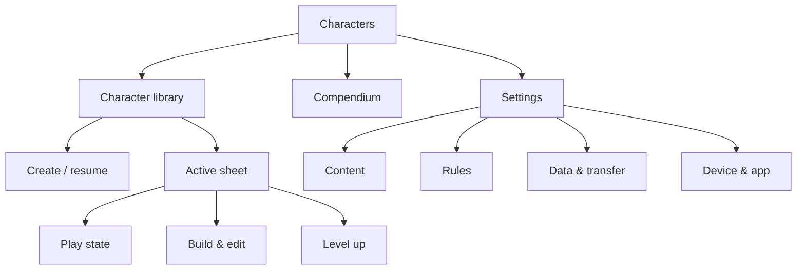
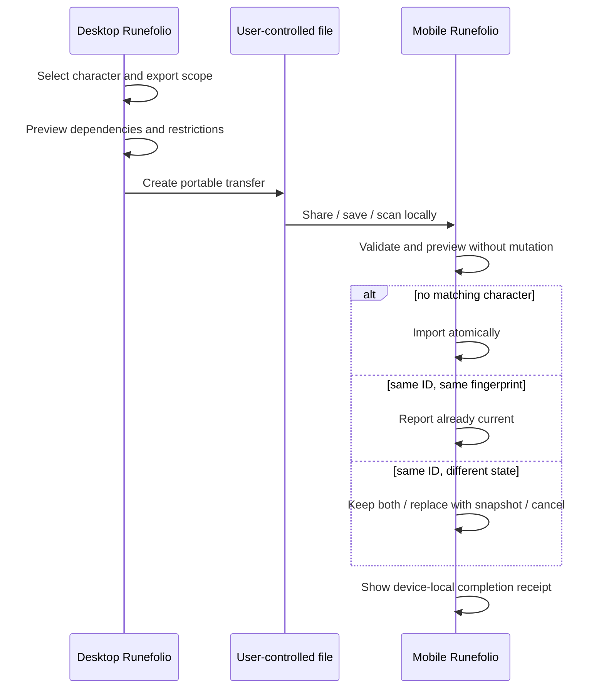

# Runefolio information architecture

## IA model

Runefolio organizes the product around user context rather than storage tables.



The character is the primary object. Packs, sources, rulesets, and transfer are supporting configuration and belong under Settings rather than competing with Characters in primary mobile navigation.

## Mobile-first navigation

### Primary navigation

Use a persistent bottom bar for the three frequent destinations:

1. **Characters** — library and creation;
2. **Sheet** — the last active character, or an explanatory empty state;
3. **Compendium** — lookup during creation or play.

Settings is opened from the top app bar or character/account-free device menu. Do not use a permanent hamburger as the sole way to reach the active sheet.

When a task is modal in intent—creation, level-up, transfer confirmation—replace the bottom bar with a task footer containing Back, issue count, and the primary next action. Native browser back must never silently abandon unsaved state.

### Mobile route tree

```text
/characters
  /new
  /:characterId
    /sheet
      /actions
      /spells
      /inventory
      /features
      /notes
    /build/:step
    /level-up
    /manage
    /history
/compendium
  /:entryId
/settings
  /content
    /packs
    /sources
  /rules
    /rulesets
  /data
    /transfer
    /imports
    /exports
    /backups
  /device
    /storage
    /offline
    /updates
  /accessibility
  /about
```

Routes describe user-visible destinations, not a mandated implementation framework. A drawer may render a detail route while preserving the URL and back behavior.

## Desktop adaptation

Desktop uses the same labels, state model, routes, and ordering. It adapts composition:

- persistent left rail with Characters, active Sheet, Compendium, and Settings;
- Settings may expose second-level navigation in the rail;
- library supports list/grid choice, filters, bulk-safe export, and side-by-side metadata;
- builder uses a step rail plus a two-pane choice/detail workspace;
- active sheet uses a responsive dashboard with a pinned character summary and optional docked detail panel;
- content pack/source editors may use wide tables and structured editors;
- transfer preview may compare local and incoming versions side by side.

Desktop must not introduce capabilities required to finish mobile creation or level-up. It can make complex administration more efficient.

## Character library

### Information priority

Each character row/card shows, in order:

1. name or “Unnamed character”;
2. level, class, and subclass when known;
3. state: Playable, Incomplete, Issues, or Missing source;
4. ruleset badge and local last-edited time;
5. optional portrait/monogram;
6. device/transfer status only when actionable.

Primary tap opens the most appropriate destination:

- playable character → Sheet;
- incomplete draft → last unresolved creation step;
- missing-source character → read-only sheet with recovery banner;
- conflicted import copy → conflict resolution.

Overflow menu: Resume build/Edit, Level up, Duplicate, Export/Transfer, Archive. Delete lives inside Manage, is never adjacent to Open, and requires naming the target.

### Library states

```text
┌──────────────────────────────────┐
│ Characters              ⚙       │
│ [ Search characters          ]   │
│                                  │
│ Brammel “Boss” Voss              │
│ Fighter 1 · 2024        Playable │
│ Edited on this device 2m ago  ›  │
│                                  │
│ Unnamed character                │
│ Class not chosen       3 issues  │
│ Resume: Class                  ›  │
│                                  │
│             [＋ New character]   │
└──────────────────────────────────┘
```

Empty library offers New character and Import from another device. It does not show a synthetic “active character” as if persisted.

## Settings structure

| Group | Contents | Mobile behavior | Desktop behavior |
| --- | --- | --- | --- |
| Content | Packs, Sources | Status/list; edit is possible but marked “easier on desktop” | Full CRUD/editor workspace |
| Rules | Rulesets, compatibility policy, default creation mode | Select defaults and inspect effective policy | Create/compare/edit profiles |
| Data & transfer | Transfer, imports, exports, backups | Receive/export character or portable bundle | Compose, preview, compare, archive |
| Device & app | Storage, offline readiness, updates, app install | Device-specific health and actions | Same device-specific information |
| Accessibility | Text size, reduced motion, contrast, dice animation, haptics/sound | Immediate preview | Same controls |
| About | Version, privacy model, licenses | Compact | Compact |

“Imports & exports” is too implementation-oriented as a top-level product destination. “Data & transfer” describes the job and can contain the existing content import/export interfaces without changing their service boundaries.

## PC-to-mobile transfer without cloud sync

### Transfer artifact

A transfer is a file or QR-delivered local payload containing a sanitized manifest and selected records. The UI must distinguish:

- character-only safe export;
- character plus allowed dependencies;
- restricted/private dependencies, which require separate explicit confirmation;
- full backup, which is not the default phone-transfer path.

The manifest shown before import includes character stable ID, name, updated timestamp, ruleset, level, dependency counts, restricted-content presence, format version, and fingerprint. It must not expose private full text in diagnostics or QR labels.



Conflict choices:

- **Keep both** creates a new character ID and appends “Imported copy” to the display name;
- **Replace local** first versions/snapshots the local record and shows what will change;
- **Cancel** performs no mutation;
- field-by-field merge is deferred until its semantics are fully specified.

QR is an encoding/transport option, not sync. Large or restricted bundles should fall back to a file with explicit size and privacy explanation.

## Cross-product states

| State | UI contract | Primary action | Never do |
| --- | --- | --- | --- |
| Empty | Explain what belongs here and show one safe starting action | Create / import | Populate fake durable data |
| Loading | Preserve layout, identify local operation, announce after delay | Usually none | Infinite spinner without context |
| Incomplete | Show saved state, issue count, and next unresolved choice | Resume | Block library access or saving |
| Missing source | Preserve resolved snapshot where possible; name stable ID/path, not private value | Re-enable/import source or keep manual snapshot | Substitute another definition silently |
| Conflict | Compare metadata and consequences before mutation | Keep both / replace / cancel | “Latest wins” without device authority |
| Offline | Keep local features active; mark only network-dependent actions | Continue locally | Disable the whole app |
| Save failure | Keep edits in memory, expose retry and safe copy/export where possible | Retry | Navigate away or clear the form |
| Update ready | Defer during creation/play; explain restart impact | Update when safe | Reload mid-transaction |

## State hierarchy and banners

Use one highest-priority persistent banner per surface:

1. data at risk / save failed;
2. missing source or blocked calculation;
3. unresolved transfer conflict;
4. incomplete/warning summary;
5. offline/update information.

Lower-priority state remains accessible in an issue center. This prevents stacked banners from consuming the mobile viewport.

## Global search

Global search should not remain an inert header field. Until it can return characters and compendium entries with privacy-safe indexing, remove it from the mobile header. The Compendium retains local scoped search. Desktop may expose global search only after keyboard navigation, result grouping, empty/error states, and local-only indexing are implemented.

## Naming and vocabulary

| Use | Avoid | Reason |
| --- | --- | --- |
| On this device | Synced | No automatic cloud sync |
| Transfer | Share to cloud | User controls transport |
| Issue / warning | Invalid character | Flexible builds remain saveable |
| Automatic value | Correct value | Overrides may be intentional |
| Manual value / override | Custom hack | Neutral, auditable language |
| Origin | Race/background bundle | Aligns with recommended flow while allowing species/background detail |
| Active sheet | Dashboard | Names the play job |
