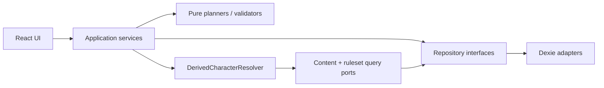

# M2.1 service boundaries

## Architectural rule

IndexedDB through Dexie remains authoritative, but only repositories know Dexie. React components, hooks, view models, planners, validators, the derived resolver, and transfer parsers never call `db.*` or Dexie tables directly.

This document defines logical repository contracts for M2.1. It does not change the current Dexie schema or database code. Any physical table/index migration required by implementation must receive its own schema review, transactional migration, rollback tests, and privacy scan.

## Shared contracts

All mutation commands contain:

- stable target ID;
- immutable input payload;
- `expectedRevision` or explicit “record must not exist” precondition;
- caller-generated operation ID for retry idempotency where appropriate;
- ISO timestamp supplied by an injectable clock.

All mutation results contain:

- new revision/version identity;
- sanitized issues by code and field path;
- resulting state summary or a query token;
- no private field values in errors.

Stale state is a typed outcome, not an exception string. A stale command performs no writes. Services may retry a read-only plan, but never retry a user mutation against a different revision without showing a new preview.

## Record responsibilities

| Logical record | Owner | Purpose |
| --- | --- | --- |
| Character draft | CharacterDraftService | In-progress choices, mode preference, issue plan, revision |
| Current character | CharacterBuildCommitService / CharacterLevelUpService / TransferService | Latest committed durable build state |
| Character version | VersionRepository | Immutable durable character history |
| Restore snapshot | SnapshotRepository | Version reference plus runtime state at an explicit recovery boundary |
| Runtime state | CharacterRuntimeService / LevelUpService | HP, temporary HP, resources, conditions, other session state |
| Session action | ActionLogRepository | Lightweight reversible runtime mutation metadata |
| Override | Build/Commit and LevelUp services | Typed durable `replace`/`add` provenance |
| Derived view | DerivedCharacterResolver | Ephemeral calculated sheet, explanations, and sanitized issues |

Derived values are not authoritative durable character choices. A derived snapshot may be stored for transfer, recovery, and missing-source readability, but it is labelled with character revision, ruleset/content fingerprint, and calculation confidence.

## CharacterDraftService

### Responsibility

Create, autosave, resume, and abandon an in-progress build without creating committed character versions.

### Inputs

- `CreateDraftCommand`: draft ID, ruleset profile ID, initial level, presentation mode;
- `UpdateDraftCommand`: draft ID, expected revision, immutable patch/choice operation;
- `ChangePresentationCommand`: draft ID, expected revision, guided/flexible mode;
- `AbandonDraftCommand`: draft ID, expected revision.

Presentation mode changes guidance only. It cannot clear selections, manual values, or overrides.

### Outputs

- draft snapshot with revision and last committed step;
- pure validation/issue summary;
- save receipt or typed stale/not-found outcome.

### Reads and writes

Reads/writes `CharacterDraftRecord`. Reads ruleset/content through query ports for planning; it never writes content records, characters, versions, snapshots, runtime state, or action log.

### Transaction and rollback

Each accepted autosave is one transaction containing compare-and-swap revision validation and the draft write. No record changes on stale revision or validation-boundary failure. Field keystroke buffers remain UI state until submitted to the service.

### Privacy/logging

Operational logs may include operation code, draft stable ID, expected/actual revision, step ID, issue codes, and duration. They exclude name, biography, notes, manual values, imported payloads, and content text.

## CharacterBuildCommitService

Also referred to as the Character Build/Commit service.

### Responsibility

Turn a reviewed draft or durable edit plan into a committed character, version, initial/current runtime state, overrides, and where required a restore point.

### Inputs

- draft ID and expected draft revision;
- expected current character revision for edits, or must-not-exist for first commit;
- accepted issue acknowledgements;
- immutable commit intent (`create`, `edit`, `manual-sheet`, `restore`);
- expected ruleset/content fingerprint from Review.

### Outputs

- committed character ID/revision and version ID;
- optional restore-point ID;
- initial runtime-state revision;
- derived-query token and sanitized issue summary.

### Reads and writes

Reads draft, current character when editing, current version sequence, ruleset/content versions, and existing overrides. Writes current character, immutable version, typed overrides, initial/current runtime state, resolved validation issues, optional restore snapshot, and draft completion marker/removal.

### Derived values

The service asks `DerivedCharacterResolver` for a pure commit plan. It does not duplicate formulas. Review and confirm use the same planner inputs. Immediately before writing, it rechecks draft, character, ruleset, and content fingerprints; a mismatch returns StalePreview.

### Transaction and rollback

All durable records for one commit are written in one Dexie transaction. For replacement, the outgoing current state must already have or receive an immutable version before the current record is replaced. First commit creates version 1. Any failure rolls back character, version, overrides, runtime, issues, snapshot, and draft-status changes together.

### Privacy/logging

Logs contain stable IDs, revisions, counts, fingerprints, and issue codes only. Resolver explanations returned to the UI may identify public/synthetic source IDs and numeric contributors but never private full text or notes.

## CharacterQueryService and DerivedCharacterResolver

### Responsibility

Provide read models for Library, Review, Play, history, and transfer preview. Resolve durable choices plus ruleset/content plus runtime state into a deterministic sheet with explanations and confidence.

### Inputs

- character or draft ID;
- requested revision/current state;
- optional runtime revision;
- requested projection such as library card, review, play, or transfer-safe summary.

### Outputs

- immutable view model;
- derived values and explanation trace;
- completeness classification: renderable automatic, renderable manual, guided-complete, or incomplete;
- sanitized issues, missing dependency IDs, and stale override markers;
- ruleset/content fingerprint.

### Reads and writes

Reads through character, draft, version, snapshot, runtime, ruleset, source, pack, and content query repositories. It writes nothing.

### Calculation boundary

`DerivedCharacterResolver` is the only application-layer component that invokes pure rules evaluation for character-derived values. It applies allow-listed typed overrides after calculating the automatic baseline. Repositories never calculate derived values; UI never calculates authoritative values.

### Privacy/logging

Read diagnostics may include stable IDs, missing dependency IDs, field paths, issue codes, and timing. They exclude private labels where avoidable, full text, notes, biography, raw imported JSON, and manual values.

## CharacterRuntimeService

### Responsibility

Apply bounded play mutations without changing durable build choices or creating a character version.

### Inputs

- character ID and expected runtime revision;
- operation ID;
- typed operation: damage, heal, spend/recover resource, add/remove condition, or apply rest;
- numeric delta/condition stable ID and optional private note kept only in runtime/action storage.

### Outputs

- updated runtime state and revision;
- appended action ID;
- inverse/undo command metadata when safe;
- sanitized bounds warning or stale outcome.

### Reads and writes

Reads current character revision, runtime state, and the minimal resolved constraints needed for bounds/reset behavior. Writes runtime state and one session-action entry. It never writes the current durable character, character version, build override, ruleset, or content.

### Transaction and rollback

Revision check, runtime mutation, and action-log append occur in one transaction. Undo is a new typed action with an expected revision and reference to the prior action; it does not delete history. Failure or stale state rolls back both runtime and action entry.

### Privacy/logging

System logs contain operation type, IDs, revisions, and numeric delta only when the target itself is non-sensitive. User notes and condition notes never enter diagnostics. The action repository may retain the private note as user content, but list/query summaries omit it unless the user opens the action.

## CharacterLevelUpService

### Responsibility

Plan and atomically commit one single-class level increase, including durable choices, new version, pre-level restore point, derived snapshot, and current/max runtime adjustment.

### Inputs

- character ID and expected character/runtime revisions;
- target level exactly current level + 1;
- expected ruleset/content fingerprint;
- new choice operations;
- accepted current-value policy or explicit manual/override adjustment.

### Outputs

- pure before/after preview;
- on confirm: character/version IDs, restore-point ID, new runtime revision, and derived-query token;
- typed stale, incomplete, or missing-source outcome.

### Reads and writes

Reads current character, latest version sequence, runtime state, ruleset/content, and overrides. Writes the pre-level restore snapshot, new durable character/version, level-up overrides/manual provenance, adjusted runtime state, and new derived snapshot.

### Derived values

The service delegates before/after calculation to the resolver and a pure level-up planner. The M2.1 policy preserves deficit/expenditure. The service does not implement hidden UI math.

### Transaction and rollback

Preview is read-only. Confirm rechecks both character and runtime revisions plus content fingerprint. Restore point, version, current character, overrides, runtime state, and derived snapshot commit in one transaction. Any failure leaves the pre-level character and runtime unchanged. Undo calls an explicit restore operation; it never deletes the level-up history.

### Privacy/logging

Logs contain stable IDs, levels, revisions, policy ID, fingerprints, and issue codes. They exclude character name, private choice values, notes, and content text.

## CharacterTransferService

### Responsibility

Create a standard safe file, validate/preview an incoming file without mutation, plan conflicts, and atomically import the confirmed plan.

### Inputs

- export: character ID/revision and safe standard-transfer scope;
- preview: unknown bytes/text plus byte limit and destination repository snapshot token;
- confirm: immutable preview token/fingerprint, conflict action, and expected destination revision where replacing.

### Outputs

- export artifact with manifest/fingerprint;
- sanitized preview: IDs, versions, counts, missing dependencies, exclusions, conflict category;
- import receipt with new/current character ID, revisions, restore-point ID when replacing, and unresolved dependency issues.

### Reads and writes

Export reads character, version, runtime, safe derived snapshot, and dependency metadata. It never reads private full text for a standard transfer. Import confirm writes character, version, runtime state, safe snapshot, and missing-dependency issues; Replace local also writes a restore point/version for the outgoing record. Keep both remaps the character ID and every internal character-owned reference deterministically.

### Validation and calculation

Parsing, forbidden-key/depth checks, format migration, strict validation, exclusion checks, and conflict planning are pure/read-only before confirm. Imported derived snapshots are display/recovery evidence, never trusted as fresh calculations. The resolver recalculates only when dependencies and fingerprints are available.

### Transaction and rollback

Confirm revalidates the preview fingerprint, destination revision, and exclusion policy. All imported/replaced records commit in one transaction. Cancel and failed validation write nothing. Standard transfer rejects embedded restricted entries rather than asking for confirmation inside this boundary.

### Privacy/logging

Logs contain file size, format version, fingerprints, stable IDs, record counts, exclusion counts, and issue codes. They never contain raw file content, private full text, biography, notes, action notes, or rejected values.

## Repository interfaces

Repositories accept domain records or typed commands and expose no React concepts. Dexie adapters implement them.

### CharacterRepository

- reads current durable character by ID and revision;
- compare-and-swap writes only inside a service transaction;
- never versions implicitly or calculates values.

### CharacterVersionRepository

- appends immutable, monotonically sequenced durable snapshots;
- rejects duplicate sequence/operation ID;
- never updates or deletes a version during normal flows.

### CharacterSnapshotRepository

- stores restore points referencing a durable version plus runtime snapshot;
- stores labelled explicit-session, pre-level, pre-import-replace, and pre-restore points;
- stores no duplicated private content beyond what recovery strictly requires.

### CharacterRuntimeStateRepository

- reads/writes one current runtime state with its own revision;
- applies no rules and never writes the durable character;
- participates in Runtime, LevelUp, Restore, and Transfer transactions.

### CharacterActionLogRepository

- appends immutable typed session actions and inverse references;
- supports bounded history queries without exposing note bodies in summaries;
- never acts as the source of truth for current runtime state.

### CharacterDraftRepository

- stores in-progress choices and presentation state with independent revision;
- is not queried as a committed character by the Play sheet;
- supports completion/abandon semantics without deleting committed history.

### OverrideRepository

- stores allow-listed typed `replace`/`add` operations with baseline and provenance;
- exposes active/stale status to the resolver;
- never evaluates strings or formulas.

## Transaction matrix

| Operation | Atomic writes | Version? | Restore point? | Action log? |
| --- | --- | --- | --- | --- |
| Draft autosave | draft | No | No | No |
| Initial commit | character, version 1, runtime, overrides/issues, draft status | Yes | No | No |
| Durable edit/override | outgoing/new version contract, character, overrides/issues | Yes | Risk-based; required for replace/restore | No |
| Damage/heal/resource/condition/rest | runtime, action entry | No | No | Yes |
| Explicit session snapshot | restore snapshot | No | Yes | Optional snapshot marker |
| Level-up | pre-level snapshot, character, version, overrides, runtime, derived snapshot | Yes | Yes | No |
| Transfer keep both | remapped character, version, runtime, safe snapshot, issues | Yes | No | No |
| Transfer replace | outgoing restore/version, replacement character/version/runtime/snapshot/issues | Yes | Yes | No |

## Forbidden dependencies

- UI → Dexie/table access;
- repository → rules engine or derived calculation;
- runtime service → durable build mutation;
- query/resolver → writes;
- transfer parser → database writes;
- imported string/expression → evaluation;
- error/analytics/test snapshot → private field values;
- standard transfer → restricted entries or private full text.

## Implementation review checklist

Before M2.1 code merges:

1. Map each logical record to an approved versioned persistence design.
2. Keep service inputs immutable and validate all unknown boundaries.
3. Add stale preview/revision tests for every mutation service.
4. Add rollback tests that assert no partial records across every transaction matrix row.
5. Add privacy tests for inputs, exceptions, logs, issues, snapshots, and transfer previews.
6. Verify only the resolver calculates authoritative derived values.
7. Verify UI code imports service/query interfaces, never `db` or Dexie adapters.
