# Character sheet: before and after

Evidence for the Character-management / Sheet information-architecture pass.
Every number and image on this page comes from a served production build at
360 × 780 CSS px, the Galaxy S23-class viewport the physical pilot uses.

- **Baseline:** `9b09605da681d7cc217ad0258771167b0ee53fb6` (merge of PR #21).
- **Measured by:** [`tests/e2e/sheet-ia-evidence.spec.ts`](../../tests/e2e/sheet-ia-evidence.spec.ts),
  which re-measures every figure below on each run and fails if one regresses.
  It attaches the same screenshots and a JSON reading per surface, so a CI run is
  a complete re-derivation of this page rather than a claim about it.

The level 12 martial and the level 9 caster are built from
[`tests/fixtures/sheet-scale-ruleset.ts`](../../tests/fixtures/sheet-scale-ruleset.ts),
original public material imported through the ordinary pipeline. The level 1
characters are the shipped synthetic slice.

## Density

| Surface | Measurement | Before | After |
| --- | --- | --- | ---: |
| Every screen | Glance header | 265 px (283 px at level 12) | **164 px** |
| Overview, level 1 | Document | 1455 px | **1264 px** |
| Overview, level 12 | Document | 1698 px | **1489 px** |
| Overview | First screen that is section content | 46% | **59%** |
| Actions, level 12 | Document | 1279 px | **1149 px** |
| Actions | Representative row | 57 px | **50 px** |
| Inventory, level 12 | Document | 1477 px | **1271 px** |
| Inventory | Representative row | 48 px | **48 px** |
| Character, level 1 | Document | 1636 px | **798 px** |
| Character, level 12 | Document | 2314 px | **794 px** |
| Character | Collapsed group | — (no groups) | **58 px** |
| Character | Open cards on arrival | 5 | **0** |
| Spells, level 1 caster | Document | 1097 px | **882 px** |
| Spells, level 9 caster | Document | 2870 px | **2384 px** |
| Tab strip, 4 tabs | Horizontal overflow | 0 px | **0 px** |
| Tab strip, 5 tabs | Horizontal overflow | 0 px | **0 px** |

Two of these need reading carefully.

**The inventory row did not shrink, and that is the intended result.** It went
from a name to a name plus the facts that change how an item is used — armour
contribution, attunement, rarity, quantity — while its description moved into the
item's own drawer. Leaving the description on the row would have made it 68 px,
which is what a first attempt measured.

**"First screen that is section content" only means something when the section
overflows.** On a level 1 martial's Actions the whole section now fits inside one
screen, so the figure *falls* (33% → 24%) because the content got shorter, not
because less of it is visible. Every surface in the table above overflows at both
measurements.

## Brand header

| | Before | After |
| --- | --- | ---: |
| Wordmark | 17 px Bookmania Bold | **20 px Bookmania Bold** |
| Logo | 28 px | **33 px** |
| Space to the left of the brand | 12 px | **114 px** |
| Space to the right of the brand | 234 px | **114 px** |
| App bar height | 60 px | **60 px** |

The brand is centred as one unit — the bar has exactly one child and no trailing
spacer — and the bar's height is unchanged, so this is a larger mark in the same
chrome rather than a taller header.

Twenty pixels is a measured ceiling, not a preference; the reasoning is in
[`BRAND.md`](../BRAND.md#the-wordmarks-size-is-measured-not-chosen).

## Screens

Full-page captures at 360 px, scaled to a 720 px tall thumbnail. The height of
each image is proportional to how much document the surface occupies, so the
pairs below are readable as density comparisons directly.

### A level 12 martial — fifteen features, four resource pools, a fourteen-line kit

| | Before | After |
| --- | --- | --- |
| Overview | 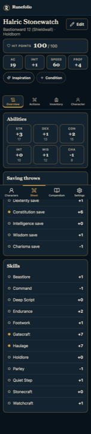 | 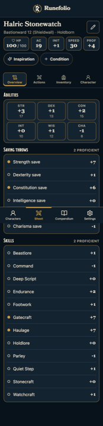 |
| Actions | 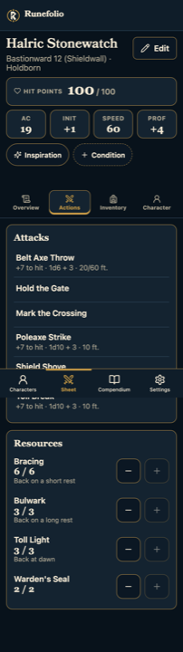 | 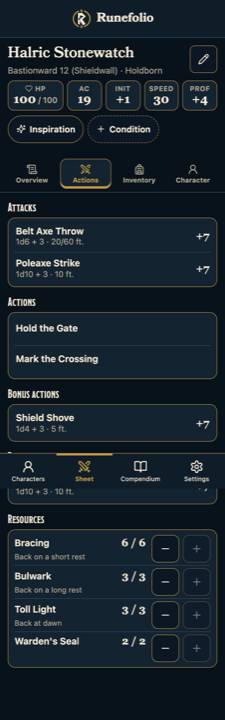 |
| Inventory | 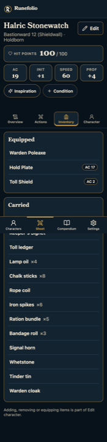 | 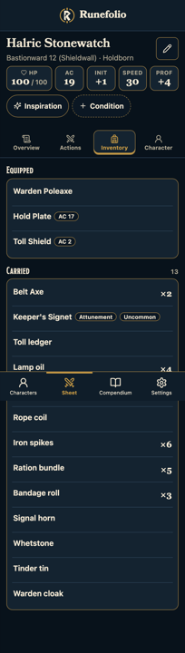 |
| Character | 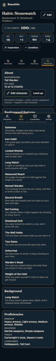 | 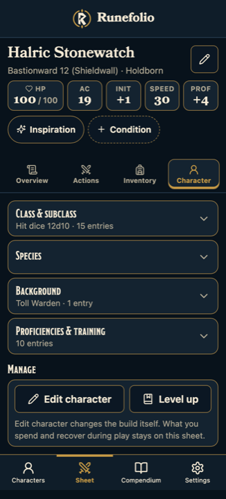 |
| Character, one group open | — | 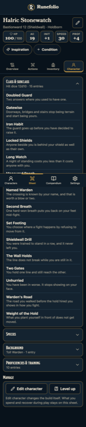 |

Character is the change this pass exists for: five open cards and 2314 px of
scroll become four closed groups that each say what is inside them, with Edit
character and Level up under them instead of behind them. The expanded capture is
the same screen with Class & subclass open — fifteen features, reached
deliberately rather than scrolled past.

### A level 1 martial

| | Before | After |
| --- | --- | --- |
| Overview | 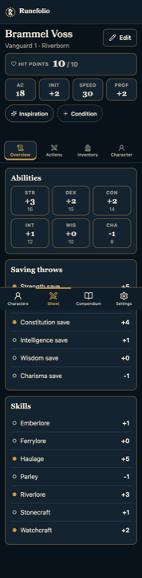 | 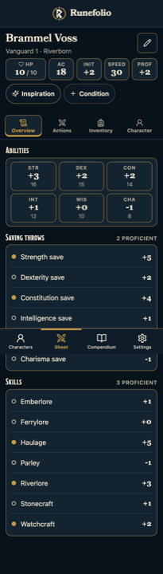 |
| Actions | 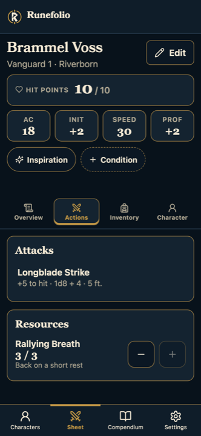 | 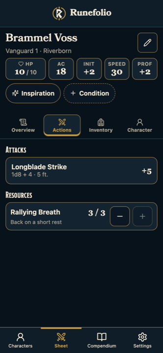 |
| Inventory | 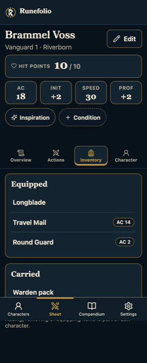 | 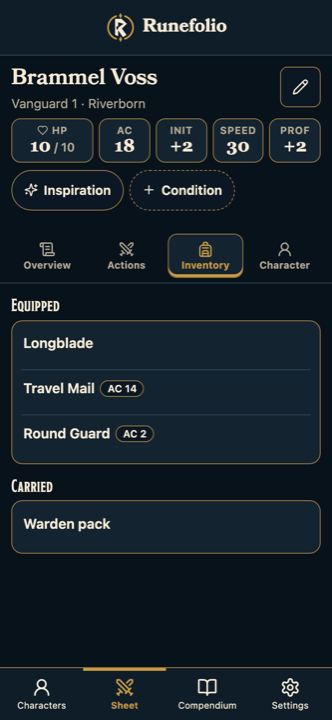 |
| Character | 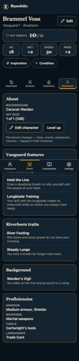 | 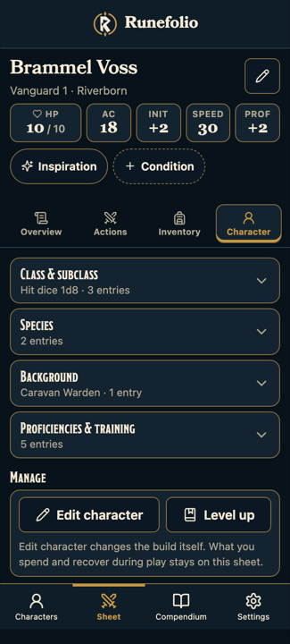 |
| Character, one group open | — | 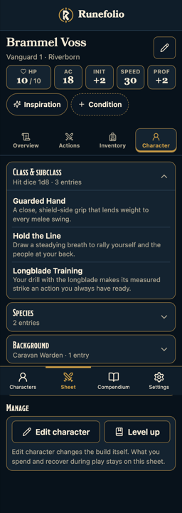 |

### Spells

| | Before | After |
| --- | --- | --- |
| Level 1 caster, 4 spells | 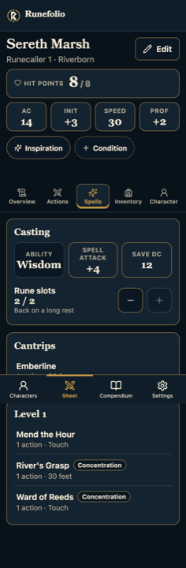 | 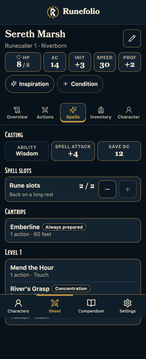 |
| Level 9 caster, 30 spells, 5 slot pools |  | 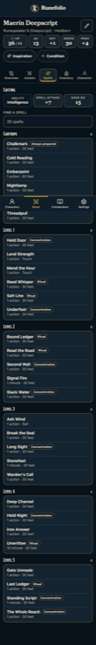 |

The level 9 pair shows both spell rules at once: the shared "back on a long rest"
is said once above the slot pools rather than five times inside them, and the
filter appears because thirty spells over six levels is past the size at which
scrolling works. The level 1 pair shows the same workspace with neither, because
four spells needs neither.

## What is not in these pictures

Nothing here shows equipping an item, attuning one, spending a charge, preparing
a spell, a sense, a movement mode, a note or a companion. Those are absent
because the generic model does not represent them, not because they were left
out of the layout. Each one is registered, with what closing it would take, in
[`CURRENT.md`](../CURRENT.md#character-management-and-the-sheets-information-architecture).
